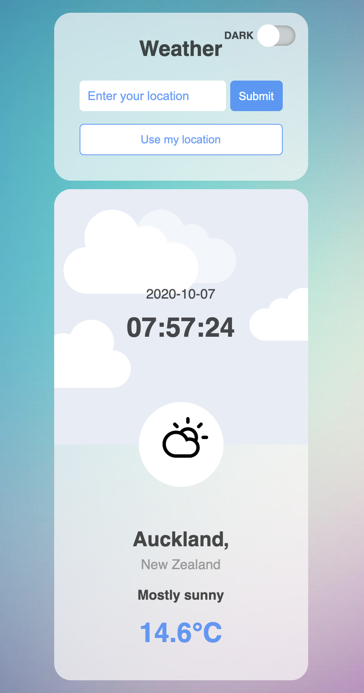
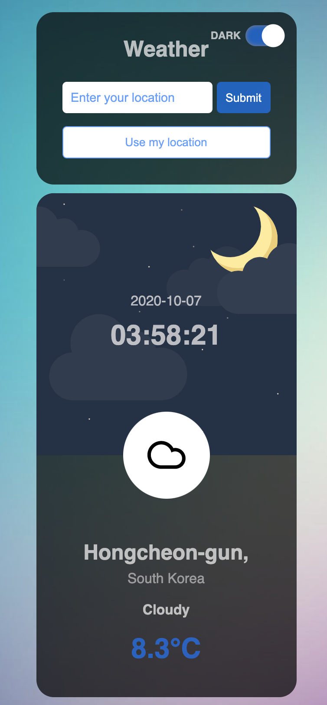

# pj__web-app__3-weather-app
## Info
- **Title**: Weather app
- **Author**: JM Woo
- **Link**: https://jayxwoo.github.io/pj__web-app__3-weather-app/
- **Log**: https://www.notion.so/3-Weather-app-252347ad71184d39b9ed892b07f3022b

## Features
- Input location with a submit button
- Display weather
- Display day or night image
- Display weather icon
- Display city location and country
- Dark mode
- Display local time (static)
- Use user's location

## Skills
- HTML
- CSS
- JS
    - DOM manipulation
    - event listener
    - class
    - async function
    - fetch
    - API
    - JS modules

## Screenshots

